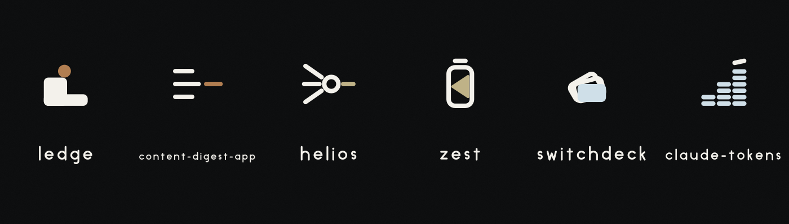

  <picture>
    <source media="(prefers-color-scheme: dark)"  srcset="design/github/profile-banner-dark.svg">
    <source media="(prefers-color-scheme: light)" srcset="design/github/profile-banner-light.svg">
    
  </picture>

# Shashank Karpal

Growth and partnerships at [KodeKloud](https://kodekloud.com), covering IMEA, APAC, and CIS. Based in Dubai.

Personal account. Everything here is built in my own time and does not represent KodeKloud.

## Why these exist

I am not a software engineer. My degree is in electronics, and software was never my trade. AI assistants closed the gap between "this annoys me" and "I fixed it," so now I build small tools for my own problems. Claude writes most of the code. I do the product thinking, the testing, and the stubborn iteration.

I have ADHD-C. Most of these close a loop my brain leaves open. Maybe one of them closes yours.

## Projects

- **[ledge](https://github.com/ShashankKarpal/ledge).** Sidebar notepad for Mac, iPhone, iPad, and Watch. One hotkey, plain Markdown, your own iCloud folder.
- **[content-digest-app](https://github.com/ShashankKarpal/content-digest-app).** Summarises what I save, builds a knowledge base I can question in plain language, emails a morning brief.
- **[helios](https://github.com/ShashankKarpal/helios).** Local-only health dashboard. Reads every wearable through Apple Health and picks the best device per metric instead of averaging them.
- **[zest](https://github.com/ShashankKarpal/zest).** Menu bar battery command center. Power flow, battery health trends, and every ecosystem device's battery in one place.
- **[switchdeck](https://github.com/ShashankKarpal/switchdeck).** Menu bar switcher and usage deck for multiple Claude Code accounts.
- **[claude-tokens](https://github.com/ShashankKarpal/claude-tokens).** Desktop widget showing daily Claude Code token usage.
- **[netwatch](https://github.com/ShashankKarpal/netwatch).** Fork of Sniffnet, adding a trust layer that flags connections you have not seen before.

Local models where possible. Nothing phones home.

## Elsewhere

- [LinkedIn](https://linkedin.com/in/shashankkarpal)
- [From AI Literacy to AI Readiness: The 2026 Playbook for Universities](https://kode.wiki/4iYMg5D)
